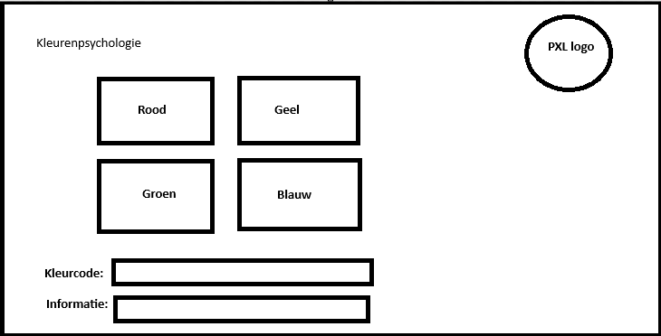

**PE2: GIT taak 1**

Verwerk de volgende vereisten zoals in de "Project Vereisten" sessie.
Maak voor elke vereiste een commit in je eigen repository. Voor je
begint, maak je uiteraard een nieuwe repository aan voor het project.

Gevraagd: maak een infopanel over kleuren.

Requirements:

| ID | Onderwerp | Beschrijving |
|---|---|---|
| KLEUR-01 | Hoofdscherm | De achtergrondkleur van het scherm is licht grijs. Er is een TextBlock met de titel van de applicatie te zien (“Kleurenpsychologie”). |
| KLEUR-02 | Afbeelding | Het hoofdscherm toont rechts boven de afbeelding van PXL. |
| KLEUR-03 | Hover effect | Wanneer de gebruiker over de afbeelding hovert met de muis, dan verandert de achtergrondkleur van het venster naar de kleur van de afbeelding.  |
| KLEUR-04 | Afbeeldingsselectie | Als gebruiker kan ik op één van de afbeeldingen klikken om de code van de kleur te zien in een apart tekstveld.
-	Groen: #008000
-	Rood: #FF0000
-	Geel: #FFFF00
-	Blauw: #0000FF
  |
| KLEUR-05 | Informatie | Als gebruiker kan ik op één van de bloemafbeeldingen klikken om de informatie van de kleur te zien in een apart tekstveld:
-	Groen is de kleur van genezing
-	Rood is de kleur van warmte
-	Geel is de kleur van levenslust
-	Blauw is de kleur van intelligentie
  |

Mockup:

